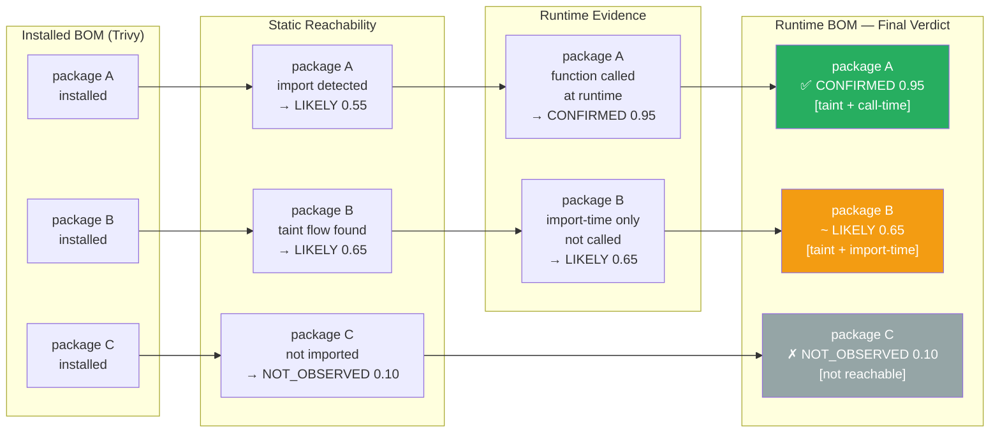
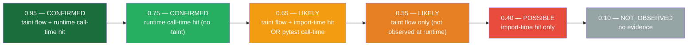

# VulnReach Architecture

## Pipeline Flow

```mermaid
flowchart TD
    A([fa:fa-code-branch Scan Request\nPOST /scan]) --> B[Orchestrator\norchestrator.execute_scan]

    B --> C{repo_url\nprovided?}
    C -- yes --> D[GitAgent\ngit clone]
    C -- no --> E[use repo_path]
    D --> F
    E --> F

    F[TrivyAgent\nSCA — installed packages\n+ CVEs] --> F_OUT[(vulnerabilities\n in ScanContext)]

    F_OUT --> G[MetadataAgent\nprobe target venv\npypi dist → import name map]
    G --> G_OUT[(import_map\nin ScanContext)]

    G_OUT --> H[TainterAgent\nstatic taint flows\nsource → sink]
    H --> H_OUT[(static taint findings)]

    H_OUT --> I[PythonReachabilityAgent\nAST call-chain\nimport detection]
    I --> I_OUT[(static reach findings)]

    I_OUT --> J{runtime.enabled?}

    J -- yes --> K{openapi_generator\n.enabled AND\nno spec found?}
    K -- yes --> L[OpenAPIGeneratorAgent\nread source files\ncall LLM\nwrite openapi.json]
    L --> M
    K -- no --> M

    M{Dockerfile\n+ OpenAPI exist?}
    M -- yes --> N[DynamicReachabilityAgent\npatch Dockerfile → build image\nstart container\nSchemathesis traffic\ncollect coverage.json]
    M -- no → skip --> O
    N --> N_OUT[(dynamic coverage\nfindings)]
    N_OUT --> O

    J -- no → skip --> O

    O{pytest_coverage\nin tools?}
    O -- yes --> P[PytestCoverageAgent\nfind target venv\nrun pytest --cov\ncollect coverage.json]
    O -- no --> Q
    P --> P_OUT[(pytest coverage\nfindings)]
    P_OUT --> Q

    Q[RouteExtractorAgent\nFlask / FastAPI / Django\nroute map] --> Q_OUT[(routes)]

    Q_OUT --> R

    subgraph CORR ["Correlation Engine"]
        R[build static_reach_map\ntainter + python_reachability] --> S
        S[build dynamic_reach_map\nmerge dynamic_reachability\n+ pytest_coverage findings] --> T
        T[CorrelationService\nvuln × reach × semgrep\nper-CVE verdict + confidence]
    end

    T --> U[(PostgreSQL\nscans / vulnerabilities\nreachability_evidence\ncorrelation_results)]

    U --> V{pipeline_status\n== BLOCK?}
    V -- yes --> W([fa:fa-ban Scan BLOCKED\nCRITICAL/CONFIRMED findings])
    V -- no  --> X([fa:fa-check Scan PASSED])

    style A fill:#4a90d9,color:#fff
    style W fill:#e74c3c,color:#fff
    style X fill:#27ae60,color:#fff
    style CORR fill:#f8f9fa,stroke:#dee2e6
```

---

## Runtime Bill of Materials — Evidence & Confidence

---

## Confidence Ladder

---

## Agent Execution Model

```mermaid
gantt
    title Agent pipeline (dependency-aware, partially parallel)
    dateFormat  X
    axisFormat %s

    section Install BOM
    git clone          :a1, 0, 2
    trivy SCA          :a2, after a1, 3

    section Import Map
    metadata agent     :a3, after a2, 1

    section Static/Supplemental (parallel stage)
    tainter            :a4, after a3, 5
    python_reachability:a5, after a3, 4
    java_reachability  :a5b, after a3, 4
    multi_lang_reach   :a5c, after a3, 4
    semgrep            :a5d, after a3, 3
    route_extractor    :a9, after a3, 2

    section Dynamic Reach (parallel stage)
    openapi_generator  :crit, a6, after a5, 3
    dynamic_reachability:crit, a7, after a6, 15
    pytest_coverage    :a8, after a6, 8

    section Correlation
    correlation engine :a10, after a9, 1
```

---

## Key Decision Points

| Condition | Outcome |
|-----------|---------|
| `repo_url` in request | GitAgent clones first |
| `runtime.enabled = false` | DynamicReachabilityAgent, OpenAPIGeneratorAgent skipped |
| `runtime.enabled = true` AND OpenAPI spec exists | DynamicReachabilityAgent runs directly |
| `runtime.enabled = true` AND no OpenAPI AND `openapi_generator.enabled = true` | OpenAPIGeneratorAgent generates spec → DynamicReachabilityAgent proceeds |
| `runtime.enabled = true` AND no Dockerfile | DynamicReachabilityAgent skips (preflight fail) |
| `pytest_coverage` in tools AND no venv found | PytestCoverageAgent skips gracefully |
| `pytest_coverage` in tools AND no pytest-cov installed | PytestCoverageAgent skips gracefully |
| `multi_language_reachability` in tools | Runs analyzers for all detected repo languages (monorepo-aware), not just one primary |
| `pipeline_status == BLOCK` | Scan marked `blocked`, CI gate fails |

---

## AI Layer (optional, on-demand)

VulnReach separates **deterministic correlation** (source of truth) from
**AI augmentation** (analyst guidance only).

```mermaid
flowchart LR
    subgraph DET ["Deterministic pipeline (always runs)"]
        SCAN[POST /scan] --> AGENTS[agents] --> CORR[correlation.engine] --> FINDING[(finding\nverdict + evidence)]
    end

    subgraph AI ["AI layer (lazy, optional)"]
        REQ[POST /findings/&#123;id&#125;/next-steps] --> EGB[EvidenceGraphBuilder]
        FINDING -.read-only.-> EGB
        EGB --> CACHE{cache hit?}
        CACHE -- yes --> RESP[response]
        CACHE -- no --> NSR[NextStepsReasoner] --> ANTH[Anthropic Claude]
        ANTH -- ok --> STORE[cache &amp; return] --> RESP
        ANTH -- failure --> DEG[status=degraded\nreturn graph only] --> RESP
    end
```

**Hard rules**

1. The scan pipeline **never** calls the LLM. Scans stay fast, cheap, reproducible, and fault-tolerant.
2. The LLM **never** sees raw scanner JSON. It consumes only the normalised `EvidenceGraph` (`correlation/evidence_graph.py`).
3. The LLM **never** overrides verdicts. It receives the deterministic verdict as input and is prompted to treat it as ground truth.
4. LLM failures cannot fail the endpoint — degraded responses still return the `EvidenceGraph` so analysts retain value when the AI is down.

**Versioned contracts**

| Contract | Constant | Bumped when |
|---|---|---|
| EvidenceGraph schema | `EVIDENCE_GRAPH_VERSION` in `correlation/evidence_graph.py` | Graph shape changes (new fields, renamed fields, semantic shifts) |
| System prompt + I/O schema | `PROMPT_VERSION` in `agents/agent_next_steps.py` | Prompt rewrite, output schema change |

Both are echoed on every response and composed into the cache key
(`finding_id + evidence_hash + prompt_version`) so a bump on either
side invalidates stale entries automatically.

**Why on-demand only (for now)**

This layer stays lazy / per-request until:

- prompts stabilise
- the EvidenceGraph schema stabilises
- evaluation metrics exist for output quality
- caching strategy matures (in-memory LRU today)
- cost profile under real-world finding volume is understood

The current `POST /findings/{id}/next-steps` is intentionally the only
AI endpoint. Future siblings on the same plumbing are planned:

- `POST /findings/{id}/explain` — narrative-style explanation
- `POST /findings/{id}/validate` — synthesise a runtime probe to confirm
- `POST /findings/{id}/remediate` — focused upgrade-and-patch plan

